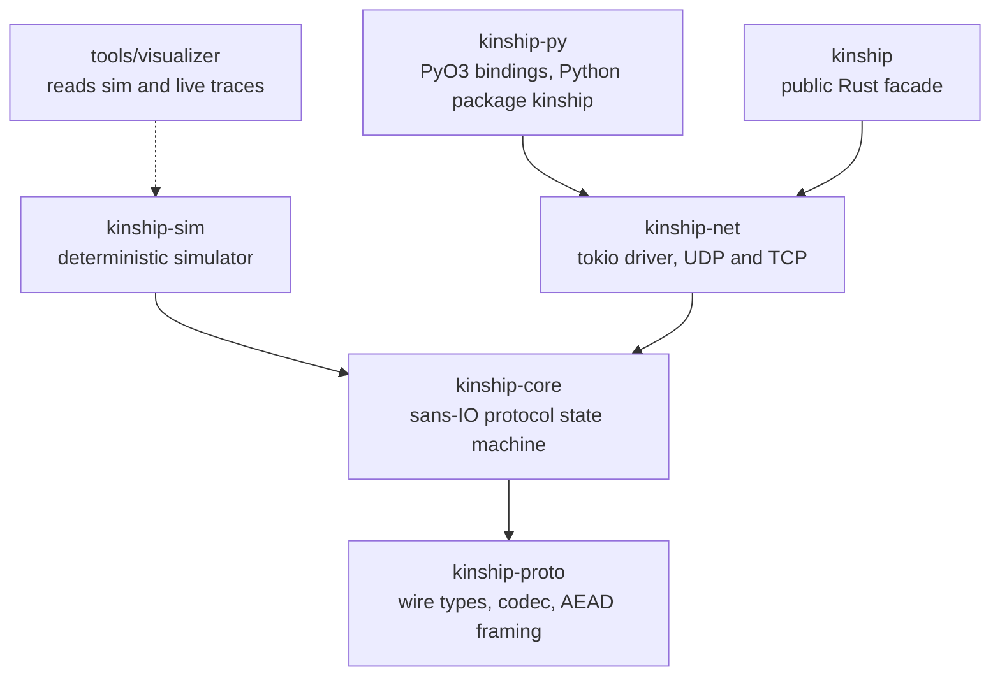
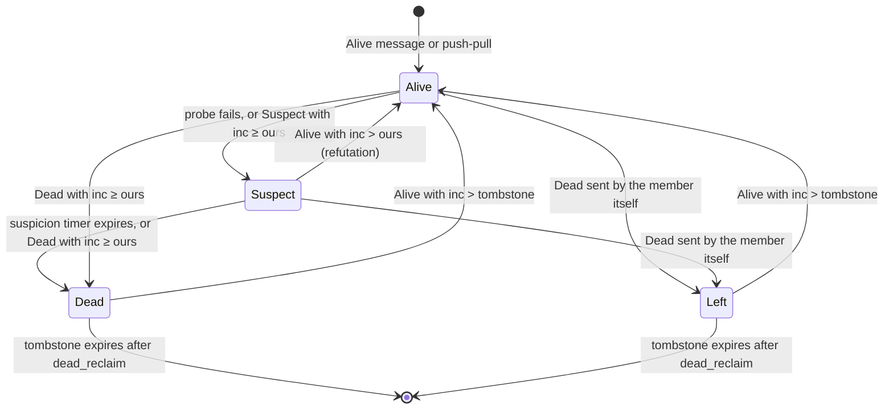
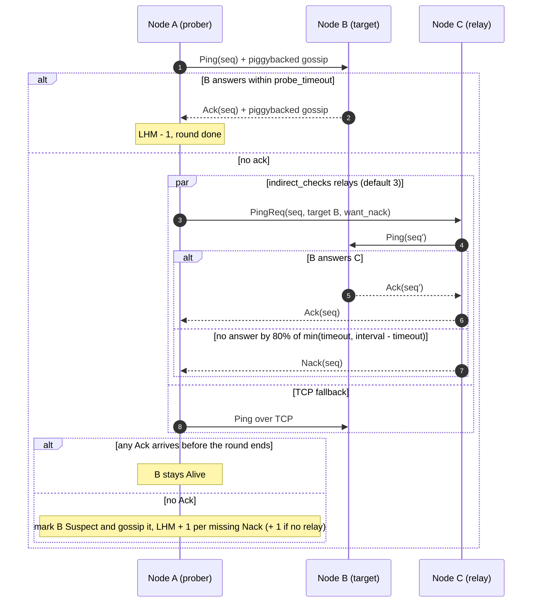
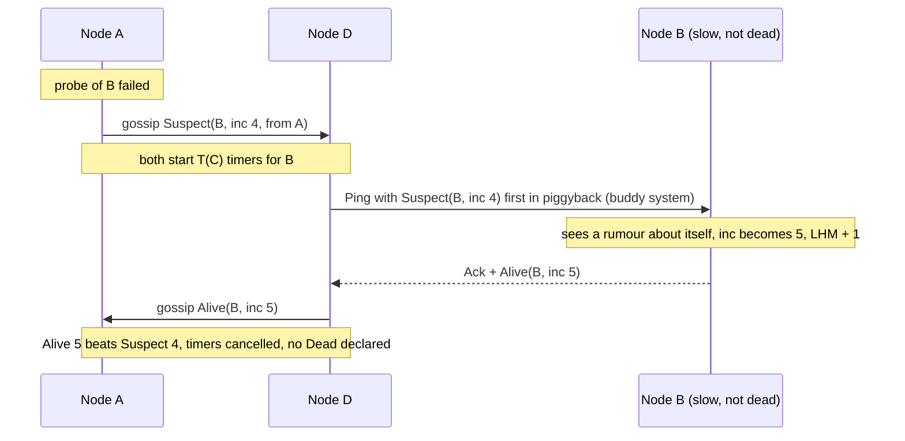
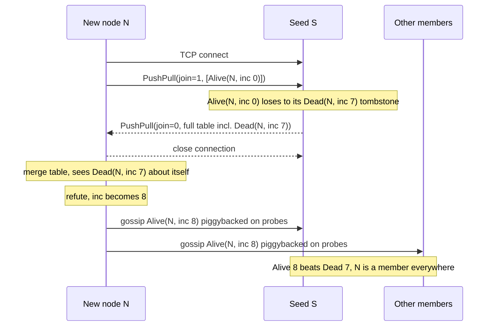
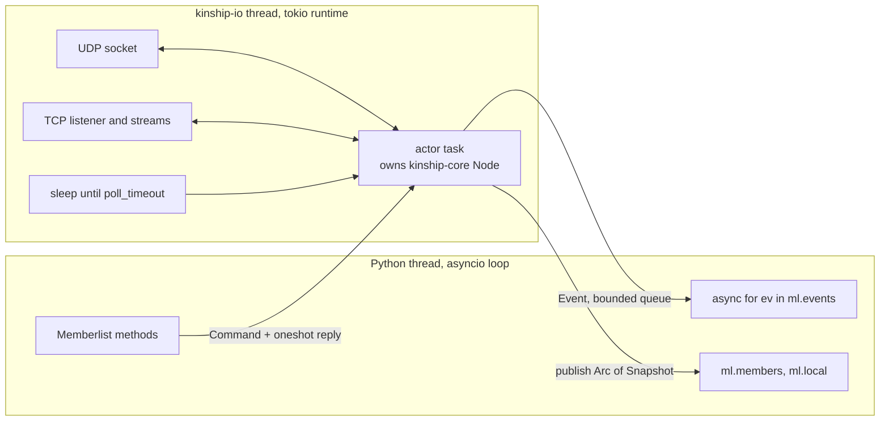
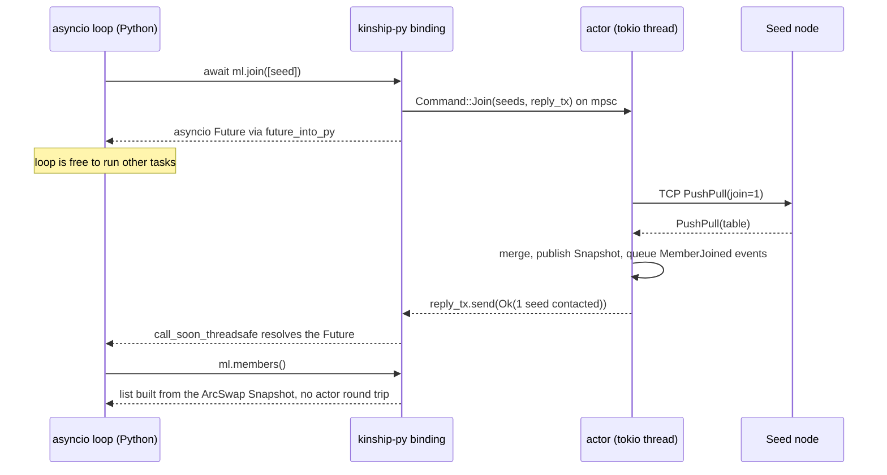
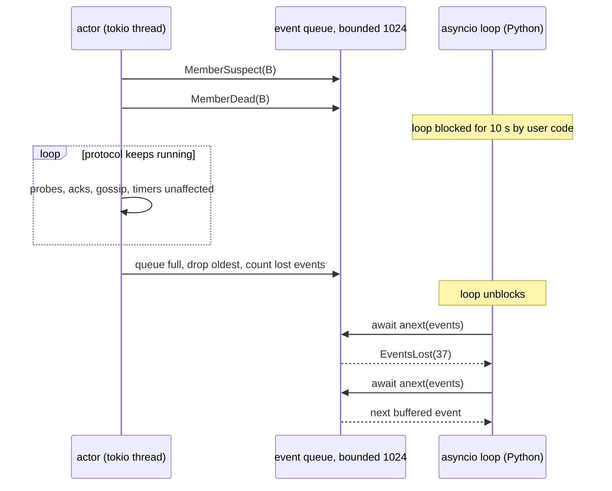
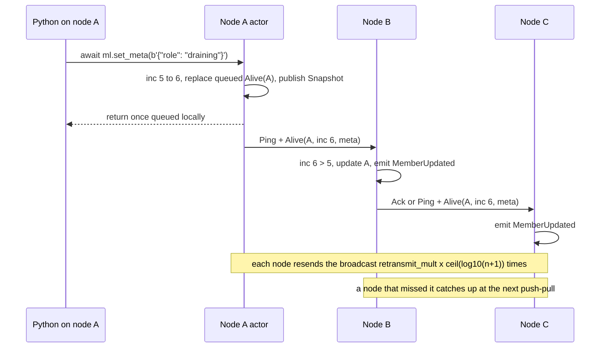

# kinship: Design Doc

Oct 4, 2026 · @Nikola Stankovic

kinship is a SWIM membership and failure detector with full Lifeguard, built as a sans-IO Rust core, driven by tokio on its own thread, and exposed to Python as an asyncio API. The name is provisional: flocking and shoalnet are the alternatives, and every crate and module name below changes with it.

## Overview

The design follows the [research report](https://claude.ai/code/artifact/2da21f6f-4e88-43d4-9fa4-c8ae09fb5cd4) and the [build decision and brief](https://claude.ai/code/artifact/dbd827ee-ecea-4b2b-8560-ccae11b3b04d). Three properties drive every choice:

1. **The protocol never waits on Python.** Probes, acks and timers run on a Rust thread, so a blocked asyncio loop cannot cause false deaths (the week 10 kill gate).
2. **The core is pure.** All time, randomness and I/O enter through function arguments, so one seeded simulator can replay any run byte for byte (the week 6 kill gate) and feed the visualizer.
3. **Secure by default.** Every packet and stream is authenticated and encrypted unless the user opts out by name.

**Goals for 0.1:** membership with alive, suspect, dead and left states; Lifeguard (local health, dynamic suspicion, buddy system, nacks); small opaque metadata per node; encrypted UDP and TCP; Python 3.11+ asyncio API plus a blocking API for sync code; Linux, macOS and Windows wheels, abi3 plus free-threaded 3.14t.

**Non-goals:** consensus or leader election; a key-value store or large state replication; wire compatibility with HashiCorp memberlist; multi-datacenter WAN federation.

## Crate and module layout

One Cargo workspace holds six crates; dependencies point only downward, and only the driver and the bindings know tokio exists.



| Crate | Owns | Depends on tokio |
| --- | --- | --- |
| kinship-proto | Message structs, binary codec, packet and stream framing, keyring, XChaCha20-Poly1305 seal and open | No |
| kinship-core | Member table, probe scheduler, suspicion, local health, broadcast queue, push-pull merge, events | No |
| kinship-sim | Virtual clock, simulated network with loss, delay, reorder and partitions, invariant checker, trace export | No |
| kinship-net | Sockets, timers, the actor task that drives the core, the pluggable Transport trait | Yes |
| kinship-py | pyclass wrappers, asyncio bridge, event iterator, config validation | Yes |
| kinship | Re-exports a Memberlist handle for Rust users | Yes |

Inside kinship-core each protocol concern is one module:

```
crates/kinship-core/src/
  lib.rs          Node: the sans-IO entry points
  config.rs       validated Config, presets lan() wan() local()
  time.rs         Instant(u64 nanos) and Duration, no std clock
  rng.rs          seeded xoshiro256** RNG for every random choice and nonce
  io.rs           Transmit, StreamEvent, StreamId
  member.rs       Member, State, Incarnation, precedence rules
  table.rs        member table, shuffled probe order
  probe.rs        direct and indirect probe rounds, nacks
  suspicion.rs    Lifeguard suspicion timers and confirmations
  awareness.rs    local health multiplier (LHM)
  broadcast.rs    transmit-limited gossip queue
  sync.rs         push-pull state exchange and merge
  event.rs        Event enum surfaced to drivers
  metrics.rs      counters the driver exports
```

The core's whole surface is five calls in and three out, modelled on quinn-proto:

```rust
impl Node {
    pub fn new(cfg: Config, me: Identity, now: Instant, seed: u64) -> Result<Node, ConfigError>;
    pub fn handle_datagram(&mut self, now: Instant, from: SocketAddr, buf: &[u8]);
    pub fn handle_stream(&mut self, now: Instant, conn: StreamId, ev: StreamEvent<'_>); // Frame(&[u8]) | Closed | Failed
    pub fn handle_timeout(&mut self, now: Instant);
    pub fn command(&mut self, now: Instant, cmd: Command) -> CommandId; // join, leave, set_meta

    pub fn poll_transmit(&mut self) -> Option<Transmit>; // Datagram | Connect | Stream | Close
    pub fn poll_event(&mut self) -> Option<Event>;       // includes CommandDone { id, result }
    pub fn poll_timeout(&self) -> Option<Instant>;
}
```

Encryption sits inside the core's byte path, not in the driver, so the simulator and the fuzzers exercise exactly the bytes production sends.

## Protocol state machine

Each node holds a view of every member as one of four states, ordered by an incarnation number that only the member itself may raise. A member refutes any rumour about itself by bumping its incarnation and gossiping Alive.



### Incarnation rules

Incarnation is a u32 per member. A node starts at 0, or at the value it learns about itself during join. Incoming messages win or lose against the stored state as follows; anything that loses is dropped and not re-gossiped.

| Incoming | Stored state | Wins when |
| --- | --- | --- |
| Alive(i) | any | i > stored inc, or the member is unknown |
| Suspect(i) | Alive(j) | i ≥ j |
| Suspect(i) | Suspect(j) | i > j, as a new suspicion with a fresh timer, since the member refuted j; i = j only adds a confirmation |
| Dead(i) or Left(i) | Alive or Suspect(j) | i ≥ j |
| any | Dead or Left(j) | only Alive(i) with i > j |

When a node receives Suspect(i) or Dead(i) naming itself with i ≥ its own incarnation, it sets its incarnation to i + 1, broadcasts Alive, and raises its local health score. Dead and Left members stay as tombstones for dead_reclaim (30 s by default) so that late rumours cannot resurrect them, then are deleted.

### Probe round

Every probe_interval × (LHM + 1) the node picks the next member from a shuffled round-robin list, so every member is probed within one pass of the list. Alive and Suspect members are probed. Dead members are not.



A Nack tells the prober that the relay is reachable but the target is not. Missing Nacks mean the prober itself is probably the one in trouble, so they raise its LHM and slow it down instead of letting it accuse others. When every relay sends a Nack the target is the one at fault and the LHM does not move. The relay times its Nack from the unscaled configuration, so it lands inside the shortest indirect phase any healthy requester runs, probe_interval - probe_timeout.

### Lifeguard

kinship ships all three Lifeguard mechanisms from day one, because they decide whether the week 10 false-positive gate passes.

- **Local health multiplier (LHM).** A score from 0 to awareness_max (8). A failed probe round raises it by one per relay that sent no Nack, or by one if no relay was asked; a refutation of a rumour about ourselves raises it by one. It falls by one on each successful probe, direct, indirect or over TCP. Probe interval and probe timeout are both multiplied by LHM + 1. These are memberlist's rules: the paper also adds one for the failed round itself, which would slow a healthy node down for detecting a real failure.
- **Dynamic suspicion timeout.** A suspicion starts at the maximum timeout and shrinks as independent members confirm it. A confirmation is a Suspect from a member that has not reported this suspicion yet, this node included when its own probe fails. With n members, C confirmations and K expected confirmations (expected_confirmations, default 3, capped at n - 2 because only that many members could confirm; with K = 0 the timeout is T_min):

```latex
\begin{aligned}
T_{min} &= \text{suspicion\_mult} \cdot \max(1, \log_{10} n) \cdot \text{probe\_interval} \\
T_{max} &= \text{suspicion\_max\_mult} \cdot T_{min} \\
T(C) &= \max\left(T_{min},\; T_{max} - (T_{max} - T_{min}) \frac{\log(C+1)}{\log(K+1)}\right)
\end{aligned}
```

- **Buddy system.** When a node probes a member it currently suspects, a Suspect from the prober goes in the Ping's packet ahead of the Ping itself, so the suspected member applies it first and its Ack already carries the refutation.

Each mechanism has its own flag (local_health, nacks, dynamic_suspicion, buddy_system), all on by default; `Config::without_lifeguard()` turns all four off for plain SWIM. Sim results comparing the two are in `docs/results/lifeguard.md`. One consequence to know: on the minority side of a partition most relays are unreachable, so the LHM climbs to its ceiling and that side detects the other more slowly, up to awareness_max + 1 times the probe interval per round. The majority side is unaffected.

The suspicion and refutation path end to end:



## Wire format

kinship uses its own versioned binary format: a fixed outer header, an AEAD-sealed body, and inside it a list of length-prefixed messages that old nodes can skip when they do not recognise the type. It is deliberately not compatible with memberlist.

### Outer packet

Every UDP datagram, and every TCP frame after a u32 big-endian length prefix, starts with this header. All integers are big-endian.

| Offset | Size (bytes) | Field | Notes |
| --- | --- | --- | --- |
| 0 | 2 | magic | 0x6B 0x6E ("kn"), drops stray traffic cheaply |
| 2 | 1 | version | wire version, 1 for 0.1 |
| 3 | 1 | flags | bit 0 encrypted, bit 1 stream frame, rest reserved and must be 0 |
| 4 | 4 | key_id | first 4 bytes of BLAKE3(key); 0 when plaintext |
| 8 | 24 | nonce | random XChaCha20 nonce; absent when plaintext |
| 32 | n | body | ciphertext of the inner payload |
| 32 + n | 16 | tag | Poly1305 tag; absent when plaintext |

The associated data for the AEAD is the 32 header bytes plus the configured cluster label (at most 255 bytes), so a packet from another cluster or a tampered header fails authentication. In plaintext mode, which exists for tests, the simulator and loopback use, an 8-byte BLAKE3 hash of the cluster label replaces key_id and nonce, giving a 12-byte header and no tag, so clusters still cannot cross-talk by accident. The encrypted overhead is 48 bytes per packet.

The receiver checks, in this order and before any cryptography: the size limit, magic, version, reserved flag bits, that the stream-frame flag matches the channel the bytes arrived on (a datagram cannot be replayed as a stream frame or the reverse), that the encrypted flag matches the node's own mode (an encrypting node never accepts plaintext, so there is no downgrade), and that some installed key has the packet's key_id. Only then does it verify the tag, once per installed key with that id. A failed verification leaves the buffer untouched. The sender takes the nonce from its caller, so the sans-IO crates never draw randomness: production passes 24 bytes from the OS RNG, the simulator passes bytes from its seeded RNG.

XChaCha20-Poly1305 is the default because its 192-bit random nonce is safe to pick at random for the life of a key, which memberlist's 96-bit AES-GCM nonce is not. AES-GCM-SIV stays an open alternative for hardware with AES acceleration and no fast ChaCha.

### Inner payload

```
payload  = count:varint  message*
message  = type:u8  len:varint  body[len]
```

A receiver skips any message whose type it does not know, using len. Within a body, new fields are only ever appended, and a receiver ignores trailing bytes it does not understand. Those two rules give forward compatibility without a schema compiler.

Encoding rules the decoder enforces, so that every value has exactly one encoding:

- A varint is unsigned LEB128, at most 5 bytes, at most u32::MAX, and minimal (no padding with zero continuation groups). Integers outside varints are fixed-width big-endian.
- A payload holds at least one message, count is checked against the bytes left before any message is read, and no bytes may follow the last message. A known message type whose body is too short is an error, not a skip.
- Booleans are exactly 0 or 1, states are 0 (Alive) to 3 (Left), and an Alive record has 1 <= vmin <= vmax.
- The whole payload is validated in one allocation-free pass, after which iterating it cannot fail. Postcard and protobuf were rejected: postcard cannot evolve fields, and prost adds allocation and size for little gain on a dozen fixed messages.

| Type | Message | Body fields | Carried on |
| --- | --- | --- | --- |
| 0x01 | Ping | seq u32, target NodeId, source NodeId, source Addr | UDP, TCP fallback |
| 0x02 | PingReq | seq u32, target NodeId, target Addr, requester Addr, want_nack u8 | UDP |
| 0x03 | Ack | seq u32 | UDP, TCP fallback |
| 0x04 | Nack | seq u32 | UDP |
| 0x05 | Alive | inc u32, node NodeId, addr Addr, meta bytes, vmin u8, vmax u8 | gossip, push-pull |
| 0x06 | Suspect | inc u32, node NodeId, from NodeId | gossip |
| 0x07 | Dead | inc u32, node NodeId, from NodeId; from = node means Left | gossip |
| 0x08 | PushPull | join u8, count varint, then count records, each a varint length and a body of state u8 followed by the Alive fields | TCP only |
| 0x09 to 0x7F | reserved | user broadcasts, compression, future features |  |

NodeId is a UTF-8 name of 1 to 64 bytes, unique within the cluster. Addr is a family byte (4 or 6), the IP, and a u16 port; IPv6 flow info and scope id are not carried. Strings and byte fields carry a varint length. Push-pull records are length-prefixed so that fields appended to Alive in a later version do not break a reader that skips them.

The `meta` field of Alive is opaque to the protocol. The Python tag API stores a list of string pairs in it as `(klen:varint key vlen:varint value)*`, running to the end of the blob, with non-empty UTF-8 keys that are unique; kinship-proto provides the encoder and a validating decoder in its `tags` module.

### Sizes and versions

- A datagram is at most udp_max_payload bytes in total, header and tag included (1,400 by default), which keeps it under a 1,500-byte Ethernet MTU with IPv6 and UDP headers. The probe message goes first, and broadcasts fill the space left; `Message::encoded_len` and `Codec::max_payload_len` let the packer measure without encoding.
- A TCP frame is a u32 big-endian length followed by one packet of at most max_stream_frame bytes (8 MiB by default, the prefix not counted). Larger push-pull states are refused and counted. The receiving `FrameReader` compares the declared length with the limit as soon as the 4-byte prefix arrives and grows its buffer only as bytes actually arrive, so a peer that announces 8 MiB costs nothing until it sends 8 MiB. A failed frame poisons the reader and the connection is dropped.
- Metadata is at most max_meta_bytes (512), checked when sealing and again when opening, so a lenient sender cannot push oversized metadata through a strict receiver.
- Each node advertises the wire versions it speaks (vmin, vmax) in its Alive message. A node sends the highest version every live member speaks, and drops packets with a version above its own vmax.
- The decoder works on borrowed slices, checks every length against the remaining buffer, never panics, and is fuzzed with cargo-fuzz from the first commit: three targets under `crates/kinship-proto/fuzz` cover datagrams, stream framing and the inner payload, and the differential check that opening a sealed payload agrees with parsing it directly. A fourth, under `crates/kinship-core/fuzz`, feeds arbitrary datagrams and stream frames to a whole node, seeded with traffic captured in the simulator. Keys are 32 bytes, zeroized on drop and never printed; the first key in the codec's list seals and any key opens, which the keyring task builds on.

## Transport

UDP carries everything small and frequent: probes, acks, nacks and piggybacked gossip. TCP carries everything large or that must arrive: the join, periodic push-pull anti-entropy, and a fallback ping when UDP probes fail. Both listen on the same port number.

| Traffic | Protocol | When |
| --- | --- | --- |
| Ping, PingReq, Ack, Nack | UDP | every probe round |
| Gossip (Alive, Suspect, Dead) | UDP, piggybacked or in gossip packets | on every probe and every gossip_interval to gossip_nodes peers |
| Join | TCP push-pull with join = 1 | on join(), to each seed until one answers |
| Anti-entropy | TCP push-pull | every push_pull_interval with one random live member |
| Fallback ping | TCP | when the UDP probe and all indirect probes fail, if tcp_fallback_ping is on |
| Reconnect | TCP push-pull | every reconnect_interval with one random dead member still in its tombstone window; members that left are not asked |

### Join and push-pull

A push-pull exchange sends the full member table both ways and merges it with the precedence rules above. On join it also tells the newcomer what the cluster believes about it, which is how a restarted node learns that it must raise its incarnation.



join() pushes-pulls with every seed at once, skipping the node's own address. It waits for the first attempt with each seed, so it can report how many answered, and succeeds if any did. Seeds that failed are retried with exponential backoff (probe_interval, then doubling) only while no seed has answered, and join() fails with JoinError once every seed has failed join_retries times. Each exchange is bounded by tcp_timeout.

The side that opened the connection writes its state and waits for one frame back; the side that accepted it merges first and then answers with its own state, so the reply already carries any refutation the merge caused, and closes. The accepting side keeps no state per connection. A merge applies each record with the precedence rules, with two differences from gossip, as in memberlist: a peer's Dead record becomes a Suspect, because this node may have heard from the member more recently and a suspicion lets the member refute, and records about unknown members add them only if Alive. That conversion is also what heals a partition: the first reconnect across it tells each side the other declared some of its members dead, those members are suspected, they refute, and the refutations spread to both sides.

### Connection handling

- TCP connections are short-lived, one exchange each, with tcp_timeout (10 s) covering connect, write and read. There is no connection pool in 0.1.
- The listener accepts at most max_inbound_streams (64) concurrent connections, and drops the oldest beyond that, so a slow or hostile peer cannot pin the actor.
- bind_addr and advertise_addr are separate, for NAT, containers and 0.0.0.0 binds. advertise_addr is what goes in Alive messages.
- The driver talks to sockets through a Transport trait with send_datagram, recv_datagram, connect and accept. The default is tokio UDP and TCP. An in-memory transport backs the integration tests, and QUIC can be added later without touching the core.

The chaos tooling injects faults at this layer from outside the process with tc netem and nftables, because Toxiproxy cannot proxy UDP.

## Threading model and the asyncio bridge

Each Memberlist runs as one actor task on a kinship-owned tokio runtime in a background OS thread. The actor alone owns the core, so there are no locks on protocol state. Python talks to it through a command channel, reads membership from a lock-free snapshot, and receives events through a bounded queue. Nothing on the protocol path ever takes the GIL.



### The runtime thread

- kinship builds one tokio runtime per process on first use, with one worker thread by default (runtime_threads from the first config to start a node; later values are ignored with a warning), and registers it with pyo3-async-runtimes as a generic runtime, so that future_into_py resolves on it. Its threads are named kinship-io.
- Each Memberlist spawns one actor task. Its loop is a tokio::select over the UDP socket, accepted TCP frames, the command channel, and a sleep until node.poll_timeout(). After each input it drains poll_transmit and poll_event.
- Whatever woke it, the actor reads every datagram and stream frame already waiting before it lets a due timer fire. The Lifeguard sim showed that a node reading its Acks after its own probe timer falsely suspects healthy peers; `crates/kinship-net/tests/flood.rs` floods a frozen actor to hold it to this.
- The Rust `Cluster` runs its actor on the caller's tokio runtime; the kinship-owned runtime thread above is what kinship-py starts.
- TCP exchanges run as separate tasks and hand complete frames to the actor over a channel, so one slow peer never blocks probes.
- The actor publishes a new immutable Snapshot through ArcSwap after every membership change. Snapshot reads never wait on the actor.

### Python to Rust

Async methods (join, leave, set_meta, shutdown) send a Command with a oneshot reply sender and return the oneshot wrapped by future_into_py as an asyncio awaitable. Sync reads (members(), local(), num_members) load the current Snapshot and convert it to Python objects, holding the GIL only for the copy.



### Rust to Python

Events flow through a bounded queue (event_buffer, 1,024 by default). If Python stops reading, the actor never waits: it drops the oldest event and the next event the user reads is EventsLost(n), so the application knows to resync from members(). The async iterator returned by events() awaits the next item with future_into_py.

Memberlist's delegate pattern, where the protocol calls user code to fetch metadata or merge state, is deliberately absent. Calling Python from the protocol thread would tie liveness to the GIL. Instead users push metadata with set_meta and react to events.



### Python surface

```python
import kinship

async def main() -> None:
    cfg = kinship.Config.lan(
        name="worker-17",
        bind="0.0.0.0:7946",
        cluster="jobs-prod",
        keys=[primary_key],
        seeds=["10.0.0.5:7946"],
        meta={"role": "worker"},
    )
    async with kinship.Cluster(cfg) as cluster:   # starts the actor, joins seeds
        async for ev in cluster.events():
            match ev:
                case kinship.MemberJoined(member=m):
                    print("joined", m.name, m.addr, m.meta)
                case kinship.MemberDead(member=m) | kinship.MemberLeft(member=m):
                    reassign_work(m.name)
                case kinship.EventsLost():
                    resync(cluster.members())
    # __aexit__ runs leave(timeout=5.0) then close()
```

### Lifecycle, GIL and process rules

- The pyclasses are frozen and Send + Sync, with no reliance on the GIL, so the same code is correct on free-threaded CPython 3.13t and later.
- shutdown() stops the actor and closes sockets. A Memberlist garbage-collected without shutdown stops its actor from Drop and logs a warning.
- A panic inside the actor is caught. Pending calls and the next call raise KinshipClosed, and the events iterator ends with that error.
- The runtime does not survive os.fork. kinship records the creating PID and raises KinshipClosed in a child process instead of hanging; a cluster the child creates after the fork gets a runtime of its own.
- Logs go through tracing. By default they print to stderr from Rust. The opt-in bridge to Python logging drains a ring buffer from an asyncio task, so a log line never makes the protocol thread wait for the GIL.

## Metadata broadcast

Each node carries up to 512 bytes of opaque metadata inside its own Alive message. Changing it is a self-refutation: set_meta raises the node's incarnation and gossips a new Alive, so the newest metadata always wins by the same precedence rules as liveness.



### Broadcast queue

The queue in broadcast.rs holds Alive, Suspect and Dead messages that still need to be spread. The same queue carries liveness gossip and metadata.

- Each entry is keyed by the member it describes. A newer message about the same member replaces the older one, so ten quick set_meta calls cost one broadcast.
- Each entry is sent retransmit_mult × ceil(log10(n + 1)) times, then dropped. With retransmit_mult 4 that is 12 sends at 100 nodes.
- When filling a packet the queue picks entries with the fewest sends first. Suspect messages for the probe target go first (the buddy system).
- Entries ride on every Ping, Ack and PingReq, and on dedicated gossip packets sent every gossip_interval (200 ms) to gossip_nodes (3) random members, including members dead for less than gossip_to_the_dead.

### Limits

- set_meta rejects metadata over max_meta_bytes (512) with ValueError, so one Alive always fits in a datagram with room for a probe.
- Metadata is for small routing facts such as role, zone, version or a load hint. Larger application state belongs in the user's own channel, and user broadcasts are reserved for 0.2.
- Metadata changes appear as MemberUpdated(member, previous_meta). Spread time is O(log n) gossip rounds, and push-pull bounds the worst case at push_pull_interval.

## Configuration surface

Users pick a preset and override a few fields; the timing defaults start from memberlist's LAN values, which have years of production behind them, and the simulator will tune them before 0.1. One Rust Config struct is the source of truth. The Python Config is a frozen wrapper with the same field names, validated in Rust when constructed, so a bad value raises ValueError before any socket opens.

| Preset | Use | Differs from lan() |
| --- | --- | --- |
| lan() | one datacenter or VPC, the default | baseline |
| wan() | nodes across regions or flaky links | probe_interval 5 s, probe_timeout 3 s, suspicion_mult 6, push_pull_interval 60 s, gossip_interval 500 ms |
| local() | one host, tests and the visualizer | probe_interval 200 ms, probe_timeout 100 ms, suspicion_mult 3, push_pull_interval 15 s |

### Identity and network

| Field | Default | Meaning |
| --- | --- | --- |
| name | hostname plus 6 random hex chars | NodeId, unique in the cluster, 1 to 64 bytes |
| bind | 0.0.0.0:7946 | UDP and TCP listen address |
| advertise | derived from bind | address other members use to reach this node |
| cluster | "default" | label bound into every packet; clusters with different labels ignore each other |
| meta | empty | initial metadata, at most max_meta_bytes |
| seeds | empty | addresses join() uses when called with no arguments |

### Security

| Field | Default | Meaning |
| --- | --- | --- |
| keys | required | list of 32-byte keys; the first encrypts, all are tried to decrypt, for rotation |
| insecure_plaintext | False | must be True to start without keys; logs a warning at startup |

Keys can be rotated at runtime with the commands InstallKey, UseKey and RemoveKey (`cluster.keyring.install / use / remove`, `use_key` in Rust), which act on the local node only, as in Serf. Installing a key already installed does nothing; using a key that is not installed, removing the key in use or the last key, and any of these on a plaintext node, are refused; removing a key that is not installed is a no-op. Key ids print as 8 hex characters and key bytes are never logged. Rotation across a cluster is: install the new key everywhere, switch the primary everywhere, then remove the old key. Leave a gap between steps for packets already in flight to land: a node that removes a key while a peer still has packets sealed with it on the wire counts them as decrypt_failures.

Key generation is not part of the keyring, which only takes keys it is given. A key is 32 bytes from the operating system's secure random source (the `getrandom` crate, as for the node seed), never from a passphrase or a seeded RNG. kinship-proto draws no randomness, so the generator is a free function `generate_key()` in kinship-net, re-exported by the kinship crate, and `python -m kinship keygen` prints it as base64 with `Key::to_base64`.

### Failure detection

| Field | Default | Meaning |
| --- | --- | --- |
| probe_interval | 1 s | time between probe rounds, times LHM + 1 |
| probe_timeout | 500 ms | wait for a direct Ack, times LHM + 1 |
| indirect_checks | 3 | relays asked to PingReq a target |
| tcp_fallback_ping | True | also try a TCP ping when UDP probes fail |
| suspicion_mult | 4 | scales the minimum suspicion timeout |
| suspicion_max_mult | 6 | maximum timeout as a multiple of the minimum |
| expected_confirmations | 3 | K in the Lifeguard timeout formula |
| awareness_max | 8 | ceiling of the local health multiplier |
| local_health | True | Lifeguard LHM: stretch probe interval and timeout when this node's own probes fail |
| nacks | True | Lifeguard: ask relays for Nacks and count missing ones against local health |
| dynamic_suspicion | True | Lifeguard: suspicion timeout starts at the maximum and shrinks with confirmations |
| buddy_system | True | Lifeguard: Pings to a suspected member carry the suspicion first |
| dead_reclaim | 30 s | how long Dead and Left tombstones are kept |

### Gossip and sync

| Field | Default | Meaning |
| --- | --- | --- |
| gossip_interval | 200 ms | time between dedicated gossip packets |
| gossip_nodes | 3 | members each gossip packet goes to |
| gossip_to_the_dead | 30 s | how long dead members still receive gossip |
| retransmit_mult | 4 | broadcast copies per log10(n + 1) |
| push_pull_interval | 30 s | anti-entropy period, 0 disables |
| reconnect_interval | 30 s | period of push-pull attempts to recently dead members, 0 disables |

### Limits and runtime

| Field | Default | Meaning |
| --- | --- | --- |
| udp_max_payload | 1,400 bytes | largest datagram sent |
| max_stream_frame | 8 MiB | largest TCP frame accepted |
| max_meta_bytes | 512 bytes | metadata cap |
| tcp_timeout | 10 s | bound on each TCP exchange |
| max_inbound_streams | 64 | concurrent TCP exchanges accepted |
| join_retries | 3 | attempts per seed, with exponential backoff from probe_interval |
| event_buffer | 1,024 | events held for Python before the oldest drop |
| runtime_threads | 1 | tokio worker threads, set once per process |

Timing fields are validated together: probe_timeout must be below probe_interval, and gossip_interval must be at most probe_interval. Invalid combinations fail construction with the field names in the message.

## Failure modes

kinship gives eventually consistent membership, not agreement: two nodes can disagree for a few gossip rounds, and a partition produces two clusters that each believe the other is dead until it heals. The last column names the tests that hold kinship to each row: Rust tests by crate and then file or module and function, Python tests by file and function. The simulator sweeps run 1,000 seeds in CI as ignored tests in release mode, and a failure prints its seed. The chaos scenarios in `tools/chaos` (week 14 gate) run kinship as separate processes on real sockets, each node in its own Linux network namespace with tc netem and nftables faults, and assert what the simulator asserts; CI runs them at 5 nodes on every pull request, and a failure prints its parameters and the command that replays them. The same harness measures detection latency against hashicorp/memberlist, in `docs/results/detection.md`.

| Failure | What kinship does | How it is tested |
| --- | --- | --- |
| Random packet loss, 1 to 5% | Indirect probes through 3 relays and the TCP fallback ping keep false suspicions rare; refutation clears the rest | kinship-sim `swim::thousand_seeds_fifty_nodes`, loss up to 5%, and `lifeguard::lifeguard_against_swim_grid` against a no-Lifeguard baseline (week 10 gate); chaos scenario `loss` in `tools/chaos`: 1 to 5% netem loss with delay, jitter and reordering on every node, and no node may declare any member dead |
| Overloaded or paused local node (GC, CPU starvation, VM steal) | Missed acks and nacks raise LHM, which stretches its own timeouts, so the sick node stops accusing healthy ones | kinship-sim `lifeguard::lifeguard_beats_swim_with_a_starved_node` and the starved cells of `lifeguard::lifeguard_against_swim_grid`; slow and paused nodes in `swim::thousand_seeds_fifty_nodes` |
| Blocked asyncio loop | No effect on the protocol thread; events queue up, then drop oldest with EventsLost(n) | `test_cluster.py::test_blocked_event_loop_causes_no_false_deaths`: a 10 s time.sleep in a handler, zero false deaths (week 10 gate) |
| Process crash or kill -9 | Probes fail, Suspect spreads, Dead after the Lifeguard timeout; on lan() at 100 nodes under netem, 9.5 s from the kill to a node's Dead at the median, 12.5 s at the 99th percentile and 12.6 s at most, against 9.9, 12.0 and 12.1 s for memberlist (`docs/results/detection.md`) | kinship-sim `swim::thousand_seeds_fifty_nodes`, every crash detected within an analytic bound; kinship `cluster::an_aborted_node_is_declared_dead`; `test_cluster.py::test_quickstart_join_crash_and_leave`; chaos scenario `kill` in `tools/chaos`: kill -9 of one node under 1 to 5% netem loss, declared dead by every live node within the analytic bound; `chaos bench` against memberlist at 100 nodes in the weekly `Detection latency` workflow |
| Graceful shutdown | leave() gossips Dead(self) as Left, sending it to gossip_nodes members at once so that even a leave that times out, followed by close(), has been heard and the peers pass it on, and waits until the rumour has been sent retransmit_limit times, up to the timeout passed to leave() (5 s by default). The node then stops probing and never refutes, so its Left cannot be undone. A relay asked to PingReq a member it knows left sends the Left rumour back instead, so a node that missed the gossip learns before it suspects | kinship-sim `sync::a_node_that_left_is_never_reported_dead_thousand_seeds`; kinship `cluster::a_node_that_leaves_is_never_reported_dead` and `keyring::a_leave_that_times_out_still_leaves`; kinship-core `tests::relays_tell_the_requester_that_a_target_left` |
| One-way UDP loss or a UDP-blocking firewall | Nacks show the relays are fine; the TCP fallback ping keeps the member Alive and a metric flags the path | One-way link blocks in kinship-sim `swim::thousand_seeds_fifty_nodes`; kinship-core `sync::tests::tcp_answers_a_ping_the_udp_path_lost`, which checks the tcp_ping_acks metric; chaos scenario `udp-block` in `tools/chaos`: nftables drops one node's UDP inbound or outbound, no node may suspect it, and every other node's tcp_ping_acks must count the fallback pings |
| Network partition | Each side marks the other Dead; reconnect_interval push-pulls to recent dead members merge the sides after healing, and refutation restores Alive | kinship-sim `sync::healed_partitions_reconverge_thousand_seeds`, which records the convergence time; partitions that never heal in `swim::thousand_seeds_fifty_nodes` |
| Partition longer than dead_reclaim | Tombstones are gone, so reconnect cannot find the other side. Every rejoin_interval each node push-pulls with any configured seed that is not a live member, so a seed on the far side merges the two; with no seed there, the application calls join() through one | kinship-sim `failure::a_partition_longer_than_dead_reclaim_needs_a_join_thousand_seeds`: the sides stay apart after the heal until one join through a seed merges them; kinship `cluster::a_node_alone_rejoins_its_seeds_in_the_background` and `cluster::a_seed_that_is_not_a_member_is_rejoined` |
| Restart with the same name | The old tombstone wins at first; the push-pull reply teaches the node its old incarnation and it refutes above it | kinship-sim `failure::a_restarted_node_learns_its_incarnation_and_rejoins_thousand_seeds`, restarting before anyone suspects it or after its tombstone spread, and never reported dead after the restart; kinship-core `sync::tests::a_restarted_node_learns_its_old_incarnation_and_refutes` |
| Two live nodes with the same name | Alive with the same name and a different address is not applied; a NameConflict event fires on both sides | kinship-sim `failure::a_second_node_with_a_live_name_never_takes_it_thousand_seeds`; kinship-core `tests::a_second_live_node_cannot_take_a_name`; `test_cluster.py::test_two_live_nodes_with_one_name_both_see_the_conflict` |
| Key mismatch during rotation | Packets that fail authentication are dropped and counted under decrypt_failures; the node looks dead to peers without the key | kinship-sim `keyring::a_node_that_falls_behind_dies_and_rejoins_thousand_seeds` and `keyring::rotating_every_node_never_raises_a_suspicion_thousand_seeds`; kinship `keyring::rotating_a_cluster_keeps_every_node_alive` |
| Garbage, truncated or hostile packets | Bounds-checked decoder drops them and counts decode_errors; never panics | cargo-fuzz targets `decode_datagram`, `decode_stream_frame` and `decode_payload` in `crates/kinship-proto/fuzz`, and `node_input` in `crates/kinship-core/fuzz`, which feeds Node::handle_datagram and handle_stream and checks that the metrics only count up; kinship-core `tests::counts_good_and_bad_datagrams` |
| Wall clock jumps (NTP, suspend) | Only monotonic time is used; a suspend looks like a long pause and is absorbed by LHM and refutation | kinship-sim `failure::a_clock_jump_is_absorbed_without_a_false_death_thousand_seeds`, a jump alone or after a suspend; the `clippy.toml` of kinship-core, which reads no clock, and of kinship-net reject std::time::SystemTime and std::time::Instant::now |
| Oversized metadata or member table | set_meta raises ValueError; push-pull frames over max_stream_frame are refused and counted | kinship-core `tests::new_rejects_invalid_config_and_meta`, `sync::tests::state_too_large_for_a_frame_is_refused` and `sync::tests::oversized_frames_are_dropped_before_they_are_copied`; kinship-net `streams::an_oversized_frame_is_refused_from_its_length_prefix`; `test_cluster.py::test_metadata_set_update_and_limits` |
| Actor panic | The panic is caught, the node moves to closed, pending and later calls fail with Closed (KinshipClosed in Python), and the events iterator ends with that error | kinship-net `tests::an_actor_panic_fails_pending_and_later_calls_and_marks_events_failed`, through a hook behind the hidden test-hooks feature; `test_panic.py::test_an_actor_panic_ends_the_event_iterator_with_kinship_closed`, run in CI against a second wheel built with that feature, never the release one |
| os.fork after start | The child raises on first use instead of hanging on a dead runtime | `test_blocking.py::test_a_forked_child_raises_instead_of_hanging` and `test_a_forked_child_can_start_its_own_cluster` |

What kinship does not protect against: split-brain decisions made by the application during a partition, a member that answers probes but is otherwise broken, and a compromised node that holds a valid key.

## Decisions from the README review

The open questions were settled on 2026-10-04 by the [README and API review](https://claude.ai/code/artifact/12fd5dc0-ae8d-49a3-8543-b1070048ab2a). Where this list and an earlier section of this doc disagree, this list wins; the README is the contract for the public API.

**Open questions, answered**

- Name: kinship.
- Node identity: a user-chosen name, defaulting to hostname plus 6 hex characters.
- AEAD: XChaCha20-Poly1305 only; the version byte leaves room for another.
- `tcp_fallback_ping`: on in `lan()` and `wan()`, off in `local()`.
- User broadcasts and compression: 0.2; message types 0x09 to 0x7F stay reserved.
- MSRV: Rust 1.85 (edition 2024). Free-threaded wheels for CPython 3.14t only, no 3.13t.
- Windows: supported in 0.1, wheels and CI included.

**API changes agreed**

1. The handle is `Cluster` in Python and Rust, not `Memberlist`; `shutdown()` is `close()`.
2. `async with Cluster(cfg)` binds and joins `cfg.seeds`, skipping its own address; explicit `join()` raises `JoinError`, the startup join only warns.
3. New config field `rejoin_interval` (60 s): while a configured seed is not an alive member, push-pull with it in the background.
4. `Config.local()` allows no keys while `bind` is loopback; any other bind needs keys or `insecure_plaintext=True`.
5. Python metadata is `Mapping[str, str]` tags (`set_meta` replaces, `update_meta` merges, `MetaTooLarge` over 512 encoded bytes); kinship-proto defines the tag encoding, Rust keeps raw bytes too.
6. New event `MemberRecovered` for Suspect to Alive.
7. Each `events()` call is its own subscription with its own `event_buffer`, starting at the call.
8. `__aexit__` always runs `leave(timeout=5.0)` then `close()`, including on cancellation.
9. `cluster.local` is a property, `num_members` is dropped, `members()` returns alive and suspect members including self, and `member(name)` also finds tombstones.
10. Python durations are `float` seconds or `timedelta`.
11. Ship `kinship.rendezvous.owner()` and `owners()` with a stable hash.
12. Rust `Config` is built with `with_*` setters and validated in `Cluster::start`.
13. The sans-IO `Node` gains `StreamEvent`, `Transmit::Connect` and `Close`, and `CommandId` with `Event::CommandDone`, as in the code block under Crate and module layout.
14. Keys rotate through `cluster.keyring.install / use / remove / key_ids()`, per node in 0.1.
15. `bind` port 0 picks an OS port shared by UDP and TCP, read back from `cluster.local.addr`.
16. `cluster.stats()` exposes the core's counters.
17. `kinship.blocking.Cluster` ships in 0.1: the same API without `async`, with `timeout=` on calls that wait on the network.
